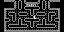

# arduboy-concepts
Some ideas for Arduboy games

[Arduboy](https://www.arduboy.com/) is a cool arduino based tiny retro video game console.

## Personal ideas

1. 1-bit Pacman  
  
A reduced size of pacman that fits in the 128px wide arduboy screen.  
To achieve that, the tiles are reduced to 4px size instead of 8px in the original game.

