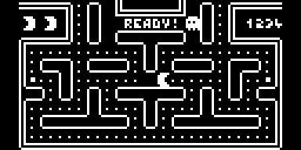

Pacman
======

  

A reduced size of pacman that fits in the 128px wide arduboy screen.  
To achieve that, the tiles are reduced to 4px size instead of 8px in the original game.  

  

Pacman sprite-sheet consists of 5 frames:  
  

Ghosts have two animations (normal and frightened) of 2 frames each:  
  

And fuits:  
  
